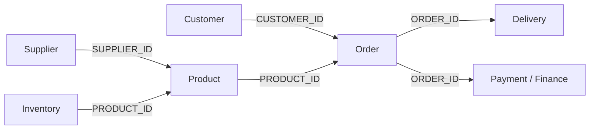
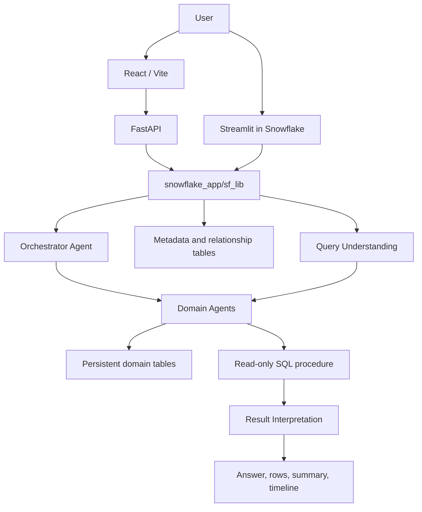
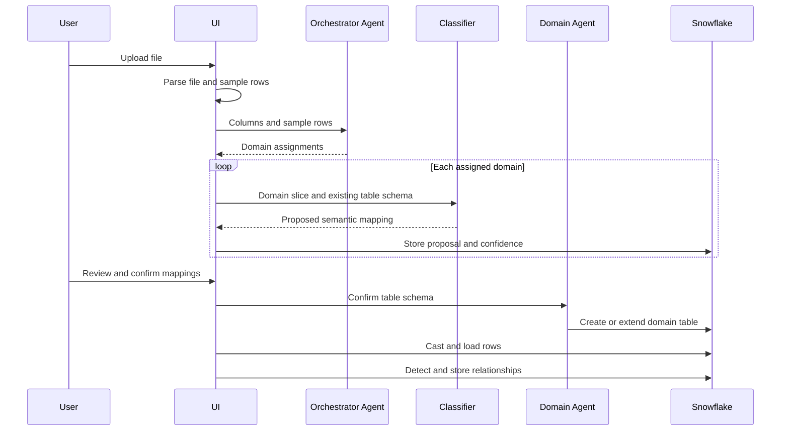
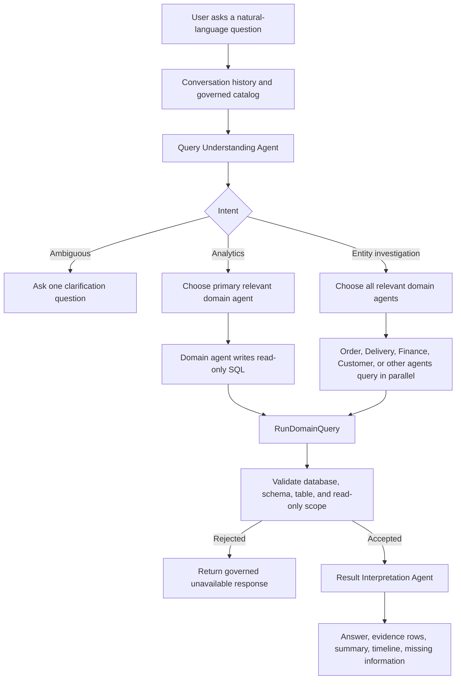
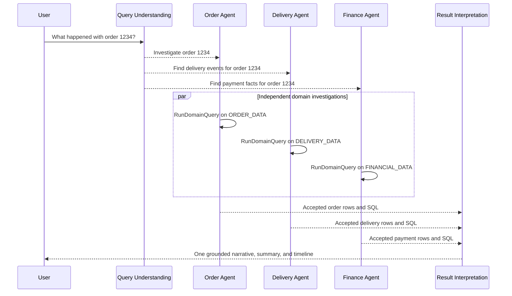

# EagleView

EagleView is a governed conversational analytics platform for supply-chain data. It turns raw files from different business systems into a shared domain model, routes questions to the right business specialists, and returns answers grounded in Snowflake data.

This project was built for the [Snowflake CoCo CLI Hackathon - GCC Edition](https://hack2skill.com/event/cococlihack-gccedition/), for the **Supply Chain Ontology and Governed Conversational Analytics** challenge.

## The Problem

Supply-chain information is usually distributed across ERP, order management, payments, logistics, product, customer, supplier, inventory, and warehouse systems. These systems use different names and definitions for related concepts. As a result, planning, procurement, finance, and logistics teams can ask what appears to be the same question and receive different answers.

EagleView creates a governed path from raw data to business meaning:

1. Upload a CSV, Excel, or JSON file.
2. Have an Orchestrator Agent identify the business domains represented in the file.
3. Let domain-specific agents classify columns and propose a normalized schema.
4. Review and edit the proposal before anything is loaded.
5. Merge the confirmed data into persistent Snowflake domain tables.
6. Ask questions in natural language and receive an answer, supporting rows, a timeline where applicable, and the agents consulted.

## What Is Implemented

- Multi-domain ingestion from CSV, XLS/XLSX, and JSON.
- AI-assisted column classification with semantic types, target names, Snowflake types, nullability, key candidates, confidence, and inclusion flags.
- One upload can be routed to multiple domains. Shared ID-like columns are propagated so domain tables remain joinable.
- Human review and confirmation before schema changes and data loading.
- Persistent domain tables that accumulate data across uploads and extend their schemas when new approved columns appear.
- Primary-key-aware loading with `MERGE`; non-key data is appended.
- Relationship discovery from approved foreign-key candidates and matching column names.
- Seven specialized business agents plus a coordinating Orchestrator Agent, Query Understanding Agent, and Result Interpretation Agent.
- Conversational query understanding for analytics, entity investigations, and clarification questions.
- Parallel domain-agent investigation for entity questions such as an order or shipment story.
- Read-only SQL validation, table allowlisting, conversation history, and result interpretation.
- Per-user Snowflake schema scoping in the FastAPI application and viewer-to-schema mapping in the native Streamlit application.
- React/Vite web UI and a Streamlit-in-Snowflake UI using the same `snowflake_app/sf_lib` pipeline.
- Demo seeding from five bundled supply-chain files.

## Supply-Chain Ontology

The ontology is implemented as a living semantic layer rather than a fixed raw-table contract. `snowflake_app/sf_lib/domain_agents.py` defines the business domains, their persistent table names, and the concepts used for routing and classification. `APP_DATASET_COLUMNS` preserves the mapping from source column to business meaning and target column for each upload.

### Core entities and domains

| Business entity or concept | Domain agent | Persistent table | Example meaning |
| --- | --- | --- | --- |
| Customer | Customer Agent | `CUSTOMER_DATA` | Buyer identity, segment, location, account status |
| Product / Part / SKU | Product Agent | `PRODUCT_DATA` | Catalog identity, category, brand, price |
| Order / Order item | Order Agent | `ORDER_DATA` | Order lifecycle, quantities, prices, tax, discount, status |
| Shipment / Delivery | Delivery Agent | `DELIVERY_DATA` | Carrier, destination, status, ETA, actual delivery, delay |
| Payment / Financial transaction | Finance Agent | `FINANCIAL_DATA` | Amount, revenue, cost, payment status, refund, currency |
| Supplier / Vendor | Supplier Agent | `SUPPLIER_DATA` | Procurement, lead time, supplier reliability and rating |
| Inventory / Stock / Warehouse | Inventory Agent | `INVENTORY_DATA` | Quantity, stock level, reorder level, inventory value |

### Relationships

The current relationship model is discovered after loading a domain slice. A column is treated as a relationship candidate when it is marked as a foreign-key candidate or follows the ID naming convention, such as `ORDER_ID` or `CUSTOMER_ID`. If another ready domain table exposes the same column, EagleView stores a relationship in `APP_RELATIONSHIPS` with source agent, target agent, source column, target column, and confidence.

The bundled demo data supports a practical chain such as:



### Canonical metric vocabulary

The agents recognize supply-chain metric concepts including:

- **On-time delivery:** deliveries completed on or before the expected delivery date.
- **Fill rate:** fulfilled quantity divided by requested or ordered quantity.
- **Days of inventory:** available inventory divided by the relevant daily demand rate.
- **Landed cost:** total acquisition cost including the applicable product, shipping, handling, duty, and other cost components available in the data.
- Revenue, expense, margin, order volume, payment status, inventory value, lead time, delay, and supplier reliability.

The live metric calculation is grounded in the uploaded columns and the generated read-only query. A deployment that requires audited enterprise KPI definitions should add explicit governed views or metric definitions for these formulas before production use; the current repository provides the domain tables, relationship catalog, semantic column mappings, and agent instructions that ground those calculations.

- **Streamlit-in-Snowflake** (`snowflake_app/streamlit_app.py`) — real per-user Snowflake
  logins, isolated by Snowflake's own RBAC.
- **FastAPI + React** (`backend/`, `frontend/`) — one shared privileged connection, isolates
  users via a dynamically provisioned schema name (`USER_<hash>`).

| Layer | Tech |
|---|---|
| Agents / data | Snowflake Cortex Agents, Snowpark, stored procedures |
| Backend | FastAPI (Python 3.12), SQLite for app metadata, Google Sign-In |
| Frontend | React + TypeScript + Vite |
| Ops / CLI | Snowflake CLI (`snow`) — inspect and test live agents from the terminal |

## Architecture — `sf_lib` module map

One module, one responsibility, imported identically by both runtimes:

There are two user-facing implementations backed by the shared Snowflake library:



### FastAPI and React

The web deployment uses:

- **Backend:** FastAPI, Snowpark, Snowflake Connector, SQLAlchemy, JWT, Google authentication, and Gemini for the authentication/application path and supporting services.
- **Frontend:** React 19, TypeScript, Vite, React Router, Recharts, and Lucide icons.
- **Application metadata:** SQLite stores application users and conversation metadata for the web path.
- **Analytical data:** Snowflake stores user-scoped domain data and the active metadata tables.

The backend entry point is [backend/app/main.py](backend/app/main.py). Active routers are [backend/app/routers/auth.py](backend/app/routers/auth.py), [backend/app/routers/datasets.py](backend/app/routers/datasets.py), and [backend/app/routers/query.py](backend/app/routers/query.py).

### Native Streamlit application

[snowflake_app/streamlit_app.py](snowflake_app/streamlit_app.py) runs the same ingestion and query pipeline inside Snowflake. It provides:

- An onboarding page for file upload, demo seeding, AI analysis, schema review, and confirmation.
- A dashboard with natural-language chat, domain status, summaries, timelines, tables, and charts when visualization metadata is returned.
- An agent activity log for demonstrating the orchestration and tool calls.

The native app is the simplest surface for a Snowflake-centered hackathon demonstration because it avoids a separate API database and runs the application beside the data platform.

## Ingestion Flow

The main implementation is [snowflake_app/sf_lib/ingestion_pipeline.py](snowflake_app/sf_lib/ingestion_pipeline.py).



### Schema governance

The review step is intentional. A model can propose a mapping, but the user controls:

- Target column name.
- Snowflake target type.
- Nullability.
- Whether the column is included.
- Whether an existing or new column should be used.

Each proposal is retained in `APP_DATASET_COLUMNS`, including its source column, semantic type, confidence, key candidates, and source (`AI_SUGGESTED` or `USER_MODIFIED`).

### Persistent loading

Each domain has one persistent table per user schema. On the first load, the domain agent creates the table. Later approved uploads extend the table with new columns instead of replacing it. If a primary-key candidate exists, the loader deduplicates the incoming batch and merges it into the existing table. Otherwise, rows are appended as event or log data.

## Conversational Analytics Flow

The query implementation is [snowflake_app/sf_lib/query_pipeline.py](snowflake_app/sf_lib/query_pipeline.py).

1. Create or reuse a conversation session.
2. Save the user question in `APP_CONVERSATIONS`.
3. Build a catalog from ready domain tables, live columns, row counts, and known relationships.
4. Ask Query Understanding to classify the request as `analytics`, `entity_investigation`, or `clarification`.
5. Select the relevant domain agent or agents.
6. Ask agents to generate and execute read-only SQL through `RUN_SELECT_PROC`.
7. For entity investigations, call relevant agents in parallel when independent Snowflake sessions are available.
8. Validate the generated SQL against the current database, user schema, and allowed domain tables.
9. Send accepted rows to the Result Interpretation Agent.
10. Return the answer, raw result rows, summary, timeline, SQL, consulted agents, and missing information.

The detailed request path is documented in [docs/query-flow.md](docs/query-flow.md).

## Multi-Agent Question Answering

Multi-agent orchestration is a central part of EagleView. The platform does not send every question to one general-purpose chatbot. It first understands the question, identifies the business domains involved, asks the appropriate domain specialists to work against their governed tables, and then combines their evidence into one answer.

### Agent roles

| Agent | Responsibility |
| --- | --- |
| **Orchestrator Agent** | Splits an uploaded file across one or more domains and ensures shared identifier columns remain available for joins. |
| **Query Understanding Agent** | Converts a natural-language question into intent, entity type, entity ID, metric, relevant tables, or one clarification question. |
| **Inventory Agent** | Answers questions about stock, warehouses, reorder levels, and inventory value. |
| **Customer Agent** | Answers questions about customers, segments, locations, and account status. |
| **Finance Agent** | Answers questions about payments, revenue, expenses, margin, cost, and financial transactions. |
| **Order Agent** | Answers questions about orders, products, quantities, prices, totals, and order status. |
| **Delivery Agent** | Answers questions about shipments, carriers, ETA, delivery status, delays, and timelines. |
| **Product Agent** | Answers questions about product catalog, SKU, category, brand, and price. |
| **Supplier Agent** | Answers questions about vendors, procurement, lead time, and supplier reliability. |
| **Result Interpretation Agent** | Converts accepted Snowflake results from one or more specialists into a concise business answer without inventing unavailable facts. |

Every domain has a primary Cortex Agent and a restricted `_SUB` agent. Primary agents can use `MergeDomainTable`, `RunDomainQuery`, and one-hop `AskAnotherAgent` delegation. Sub-agents can only run read-only queries, so delegation cannot recurse indefinitely.

### How a question is routed



### Analytics questions

For an aggregate question such as:

> Which delivery partners had the best on-time delivery rate last month?

the Query Understanding Agent identifies the delivery domain and the requested metric and period. The Delivery Agent receives the governed catalog, writes a read-only query against `DELIVERY_DATA`, and executes it through `RUN_SELECT_PROC`. The SQL validator checks the returned query before the Result Interpretation Agent summarizes the accepted rows.

Analytics questions use a primary domain agent so a cross-domain metric is not fragmented into several incompatible partial answers. The selected agent can join another allowlisted domain table when a shared key is genuinely required.

### Entity investigations

For a question such as:

> What happened with order 1234?

the platform recognizes an `entity_investigation` intent and dispatches the question to every relevant specialist. The Order Agent can retrieve order facts, the Delivery Agent can retrieve shipment and delivery events, the Finance Agent can retrieve payment status, and the Customer Agent can retrieve customer context. Independent calls use separate Snowflake sessions and run in parallel.



This is how EagleView creates one consistent answer from multiple operational systems while preserving the provenance of which agents and tables contributed to it.

### Delegation between agents

When a primary domain agent needs a fact that belongs exclusively to another domain, it may ask one other domain agent through `AskAnotherAgent`. The target is always a restricted `_SUB` agent with only `RunDomainQuery`; it cannot delegate again or mutate schemas. This gives the specialists a controlled way to collaborate without turning the question flow into unbounded agent recursion.

### Governed behavior

- Ambiguous questions produce one clarification question instead of speculative SQL.
- Missing records produce a clear no-record response.
- The result interpreter is instructed not to invent facts missing from the query results.
- Generated SQL must be a single `SELECT` or `WITH` statement.
- DDL and DML keywords are rejected by the validator.
- Fully qualified references must stay within the configured database, user schema, and allowlisted domain tables.
- Primary agents can delegate to one `_SUB` agent, while sub-agents cannot delegate further. This structurally limits recursive delegation.

## Demo Data

The same five files are available in the repository root, `backend/demo_data/`, and `snowflake_app/demo_data/`:

| File | Main business content |
| --- | --- |
| `customers.csv` | Customer IDs, names, email, signup date, city, segment, account status |
| `products.csv` | Product IDs, names, categories, brands, descriptions, unit prices |
| `orders.csv` | Orders, customers, products, quantities, prices, discounts, tax, totals, dates, statuses |
| `payments.csv` | Order and customer IDs, payment method and status, payment date, transaction ID, amount |
| `deliveries.csv` | Order and customer IDs, locations, status, carrier/partner, driver, ETA, actual delivery date |

The UI's **Load demo datasets** action sends these files through the real orchestration, classification, review/merge, and loading pipeline. It is not a hardcoded answer path.

Useful demo questions include:

- `What were total sales by customer segment?`
- `Which products generated the most revenue?`
- `What happened with order 1234?`
- `Which orders were delivered late?`
- `Show the payment and delivery status for order 1234.`
- `Compare delivery performance across delivery partners.`

The exact available identifiers depend on the bundled data that has been loaded.

## API

The FastAPI application exposes:

| Method | Endpoint | Purpose |
| --- | --- | --- |
| `GET` | `/api/health` | Health check |
| `POST` | `/api/auth/google` | Exchange a Google ID token for an application JWT |
| `POST` | `/api/auth/demo` | Sign in as a configured demo user |
| `GET` | `/api/auth/me` | Return the current user |
| `POST` | `/api/datasets/upload` | Upload and register a dataset |
| `POST` | `/api/datasets/seed-demo` | Load the five demo datasets |
| `POST` | `/api/datasets/{dataset_id}/analyze` | Analyze and propose domain mappings |
| `POST` | `/api/datasets/{dataset_id}/confirm` | Confirm mappings and load data |
| `GET` | `/api/datasets` | List datasets and ready domains |
| `GET` | `/api/datasets/{dataset_id}/status` | Read dataset status |
| `DELETE` | `/api/datasets/{dataset_id}` | Delete dataset metadata |
| `POST` | `/api/query` | Ask a natural-language question |

## Snowflake Objects

The per-user schema contains metadata tables created by [snowflake_app/sf_lib/metadata.py](snowflake_app/sf_lib/metadata.py):

- `APP_DATASETS`
- `APP_DATASET_DOMAINS`
- `APP_DATASET_COLUMNS`
- `APP_RELATIONSHIPS`
- `APP_CONVERSATIONS`

The domain-agent setup creates shared procedures and agents in `EGLE_VIEW.PUBLIC` by default:

- `MERGE_TABLE_PROC` - creates or extends a domain table.
- `RUN_SELECT_PROC` - executes the agent's read-only query tool.
- `ASK_AGENT_PROC` - performs one-hop delegation to a restricted sub-agent.
- Seven primary agents and seven `_SUB` agents, one pair per registered domain.

## Local Development

### Prerequisites

- Python 3.12 or a compatible Python 3 runtime.
- Node.js and npm.
- A Snowflake account, warehouse, database, and credentials.
- A Gemini API key if using the FastAPI application's Gemini-backed services.
- A Google OAuth client ID if using Google login. Demo login can be used for local demonstrations.

### Backend

From the repository root:

```powershell
cd backend
py -m venv .venv
\.venv\Scripts\Activate.ps1
python -m pip install -r requirements.txt
Copy-Item .env.example .env
uvicorn app.main:app --reload
```

Fill in the Snowflake and model values in `backend/.env`. The important variables are:

```text
JWT_SECRET
APP_DB_URL
CORS_ORIGINS
ALLOW_DEMO_LOGIN
GOOGLE_CLIENT_ID
GEMINI_API_KEY
GEMINI_MODEL
SNOWFLAKE_ACCOUNT
SNOWFLAKE_USER
SNOWFLAKE_PASSWORD
SNOWFLAKE_ROLE
SNOWFLAKE_WAREHOUSE
SNOWFLAKE_DATABASE
MAX_UPLOAD_MB
```

The backend defaults to `ANALYTICS_DB` in its environment example. The Snowflake-native scripts default to `EGLE_VIEW`. Choose one database and use it consistently when provisioning agents, roles, and application settings.

### Frontend

```powershell
cd frontend
npm install
npm run dev
```

The Vite development server normally runs at `http://localhost:5173`. Set the frontend API base URL and Google client ID in the frontend environment file used by the application.

For a production build:

```powershell
npm run build
```

### Snowflake-native deployment

The native deployment is intended to be run with Snowflake credentials available to the backend connector:

1. Run [snowflake_app/setup_rbac.sql](snowflake_app/setup_rbac.sql) as an administrative role and replace the placeholder passwords.
2. Review the `DATABASE`, `SCHEMA`, and warehouse constants in [snowflake_app/setup_domain_agents.py](snowflake_app/setup_domain_agents.py).
3. Run `setup_domain_agents.py` to create shared procedures and the primary/sub-agent pairs.
4. Run [snowflake_app/deploy.py](snowflake_app/deploy.py) to stage the Streamlit files and create or update `EGLE_VIEW.PUBLIC.DATAMIND`.
5. Grant the Streamlit object to the demo roles, as shown in `setup_rbac.sql` and `deploy.py`.
6. Open the Streamlit app in Snowsight and load the demo data.

The scripts currently contain Unix-oriented example commands in their docstrings. On Windows, activate the virtual environment with PowerShell and invoke the scripts with `python`.

## CoCo Hackathon Workflow

EagleView is designed to demonstrate CoCo across the full lifecycle requested by the challenge:

| Phase | Demonstration in this repository |
| --- | --- |
| Planning | Explore the bundled supply-chain data, identify domains and relationships, and define the ontology before loading it. |
| Development | Use CoCo to build and iterate on the ingestion pipeline, domain agents, procedures, semantic catalog, and application surfaces. |
| Execution | Run the Streamlit app or FastAPI plus React, seed data, onboard additional files, and ask cross-domain questions. |
| Testing and validation | Review proposed mappings, inspect activity logs, validate generated SQL, test missing data and clarification paths, and compare the same question across personas. |
| Synthetic data | Use the bundled non-production demo data or generate additional referentially consistent files before loading them. |
| Multi-agent orchestration | Use the Orchestrator Agent, specialized domain agents, one-hop sub-agent delegation, Query Understanding, and Result Interpretation. |
| Guardrails | Require confirmation before loading, restrict generated SQL, preserve conversation context, expose missing information, and stop recursive delegation. |

### Persona consistency demo

To demonstrate a shared definition across planning, procurement, and logistics:

1. Load the same data into the governed domain tables.
2. Ask the same metric question from each persona or session, such as on-time delivery by supplier or delivery partner.
3. Show that the query is grounded in the same catalog, relationships, domain tables, and accepted SQL rules.
4. Compare the result rows and answer summaries, then inspect the agent log to show which specialists were consulted.

## Repository Map

```text
EagleView/
├── backend/                 FastAPI application and Python dependencies
│   ├── app/                 API, auth, configuration, and service modules
│   └── demo_data/           Bundled input files
├── frontend/                React/Vite web client
├── snowflake_app/           Native Streamlit deployment
│   ├── sf_lib/              Shared ingestion, ontology, agents, and query logic
│   ├── demo_data/           Data staged with the Streamlit app
│   ├── setup_rbac.sql       Demo roles, users, schemas, and grants
│   ├── setup_domain_agents.py  Procedures and Cortex Agent definitions
│   └── deploy.py            Stage and Streamlit deployment script
├── docs/query-flow.md       Detailed conversational query diagrams
└── render.yaml              Render backend deployment configuration
```

## Current Boundaries and Production Hardening

This is a hackathon-ready reference implementation. The following points should be addressed before production deployment:

- The FastAPI path uses a configured Snowflake role and application-level schema scoping; it is not identical to native per-user Snowflake grants.
- The classic warehouse-runtime Streamlit deployment also applies viewer-to-schema isolation in application code. `sf_lib/rbac.py` currently maps `DEMO_USER_A` to `DEMO_A` and `DEMO_USER_B` to `DEMO_B`.
- `EGLE_VIEW` is hardcoded in the native app and setup scripts, while the backend example uses `ANALYTICS_DB`; these must be aligned for a combined deployment.
- `RUN_SELECT_PROC` checks that the query begins with `SELECT` or `WITH`; the broader database, schema, and table allowlist validation occurs afterward in the application pipeline. A production design should enforce the full scope before execution.
- Dataset deletion removes metadata rows but does not remove persistent domain-table rows or raw uploaded files.
- SQLite metadata and local raw-file storage are ephemeral on a basic Render deployment.
- `MAX_UPLOAD_MB` is documented in configuration, while the active shared ingestion module currently uses a 25 MB limit.
- No automated test suite is checked into the repository. SQL validation, schema isolation, ingestion casting, relationship discovery, and agent response paths should have regression tests before production use.
- The current implementation grounds metric generation in normalized domain tables and catalog relationships. Explicit Snowflake semantic views or governed metric objects should be added when audited, reusable KPI definitions are required.

## License

No license file is currently included in the repository.
