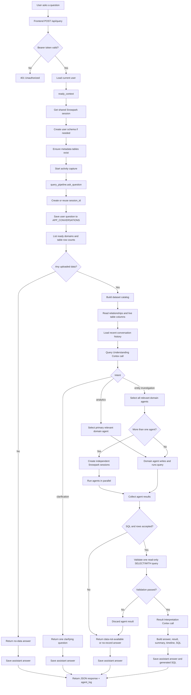
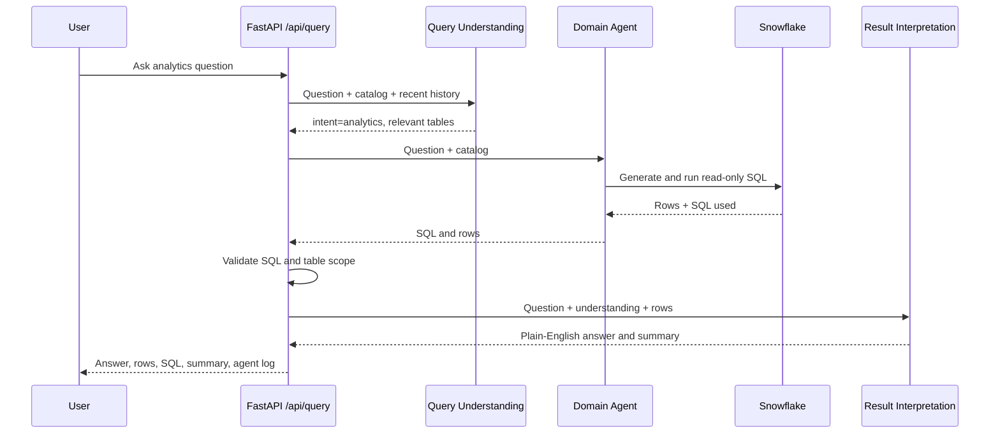
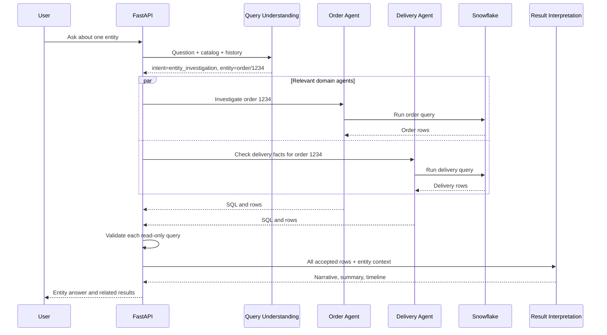
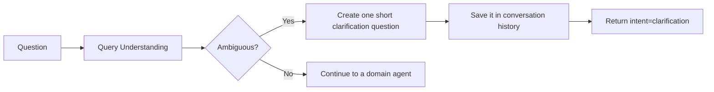
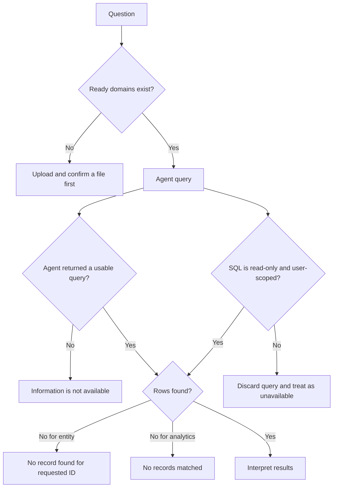

# Query Flow

This diagram describes what happens after a signed-in user asks a question from the dashboard.

## Main Request Flow

## Scenario 1: Analytics Question

Example: `What were total sales last month?`

## Scenario 2: Entity Investigation

Example: `What happened with order 1234?`

## Scenario 3: Clarification

Example: `Show me the revenue.` when the data or time period is ambiguous.

No SQL or Result Interpretation call is made for the clarification response.

## Scenario 4: No Data, No Match, or Invalid Result

## What Is Returned

Every path returns the same basic response shape:

- `session_id`: conversation identifier
- `answer`: user-facing text
- `intent`: analytics, entity investigation, clarification, or error
- `result`: raw result rows
- `timeline`: entity events when available
- `summary`: key facts when available
- `sql`: accepted generated SQL when available
- `agents_consulted`: domain agents that returned accepted results
- `agent_log`: captured progress messages
- `missing_info`: expected facts absent from the uploaded data
